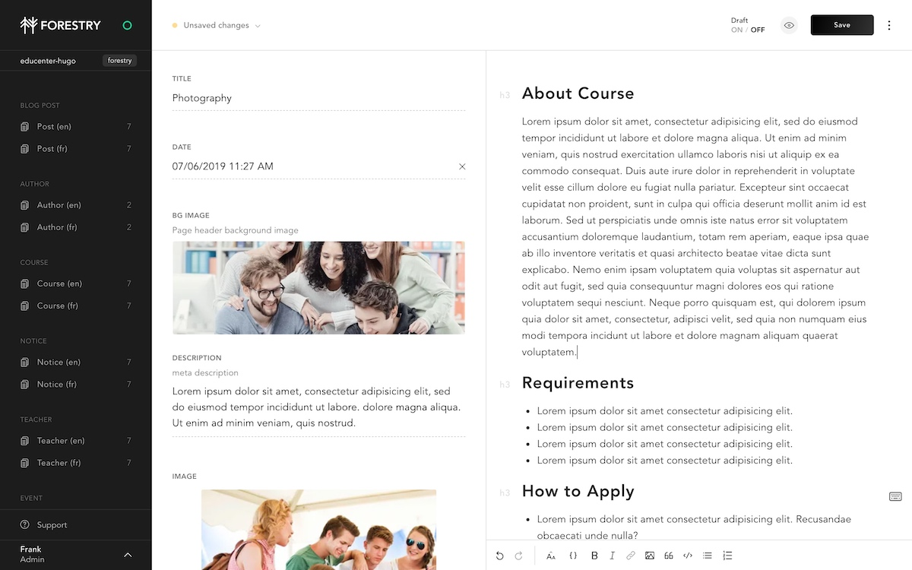

# Hugo Educenter with Forestry CMS

Port of the Hugo Educenter Theme originally by Themefischer for Forestry CMS.


Import to Forestry in one single click!

[](https://app.forestry.io/quick-start?repo=forestryio/educenter-hugo&engine=hugo&version=0.70.0)

## Prerequisites

- Hugo > 0.62.2

## Content Management



This project has been pre-configured to work with [Forestry](https://forestry.io), just import your repository ✨. \
Any changes you make will be commited back to the repo, and deployed if you're using Netlify.

## Customization

You can customize the theme through the [`config.toml` file](https://github.com/forestryio/hugo-educenter-forestry/blob/forestry/config.toml#L2-L12). Those values are accessible from within Forestry.

## Deployment and hosting with Netlify

Import your site in [Netlify](https://netlify.com)

1. Create a new site in Netlify and import your repository.
2. Set the build command to: `hugo --gc --minify`
3. Set the publish directory to: `public`
4. Set `HUGO_VERSION` to 0.70.0
3. Set the publish directory to: `public`

That's it, now your site gets deployed automatically on `git push` or when saving documents from Forestry.

## Development

```bash
# clone the repository
git clone git@github.com:forestryio/hugo-educenter-forestry.git

# cd in the project directory
cd hugo-educenter-forestry

# Start local dev server
hugo server
```

For more information, see [official Hugo documentation](https://gohugo.io/getting-started/).
